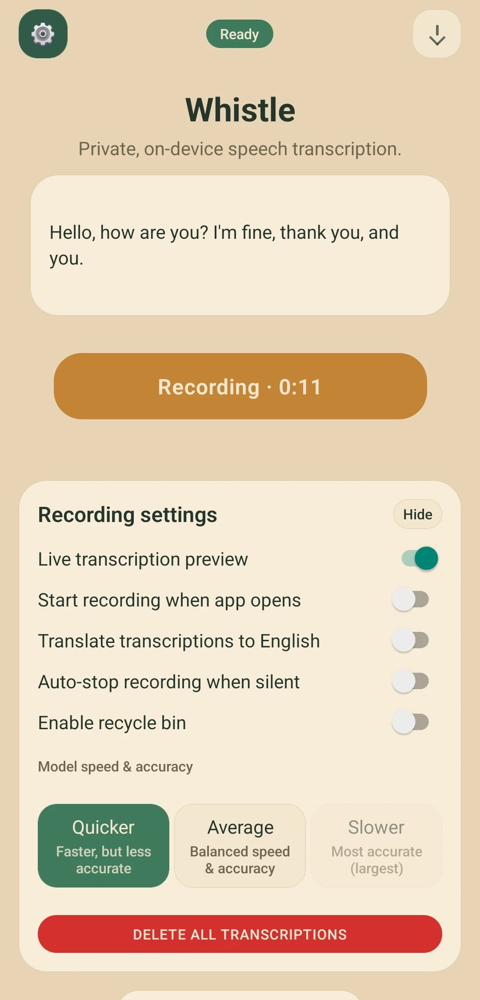
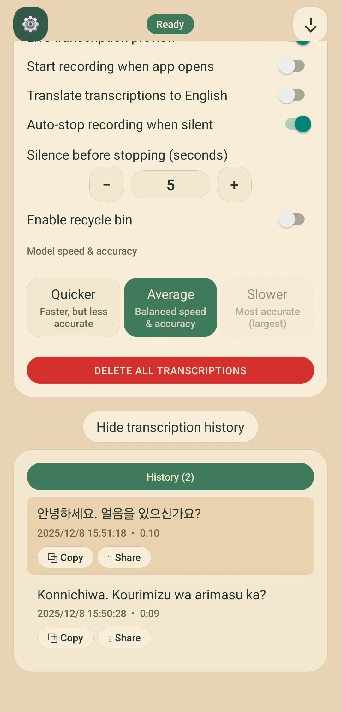
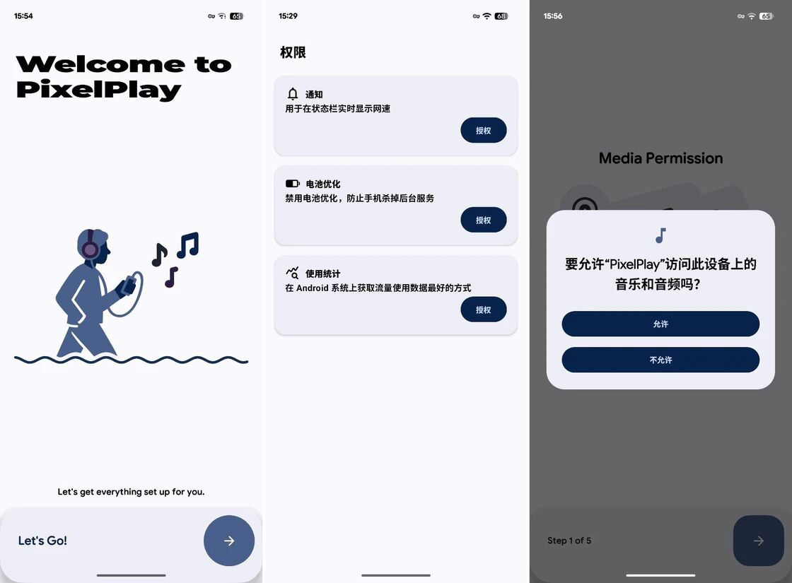
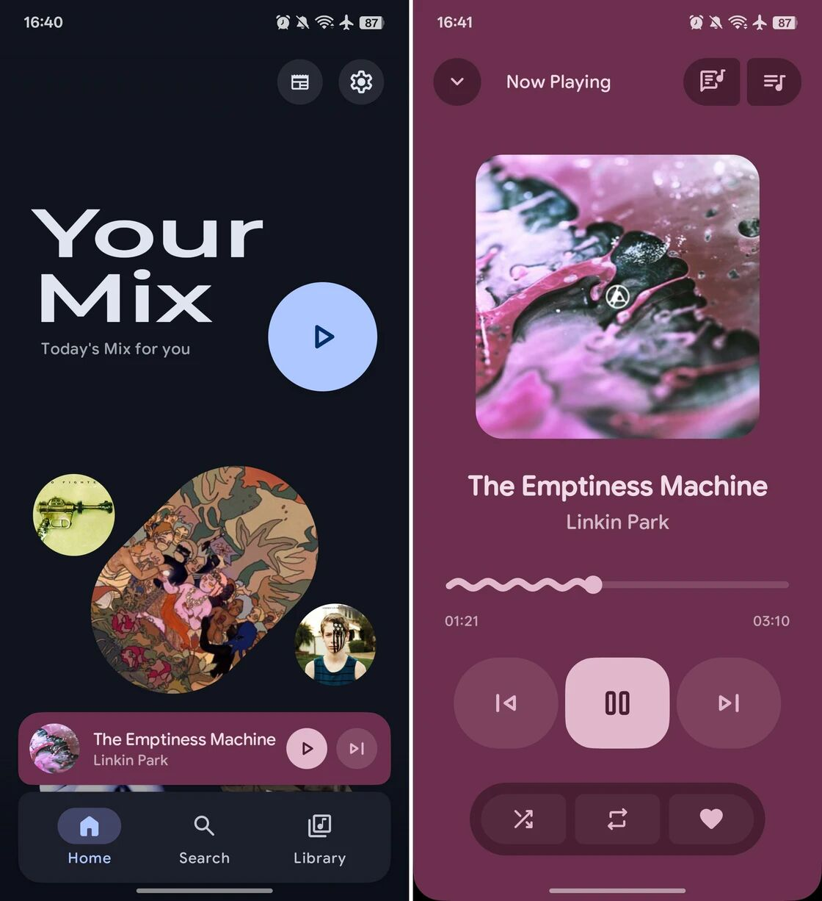
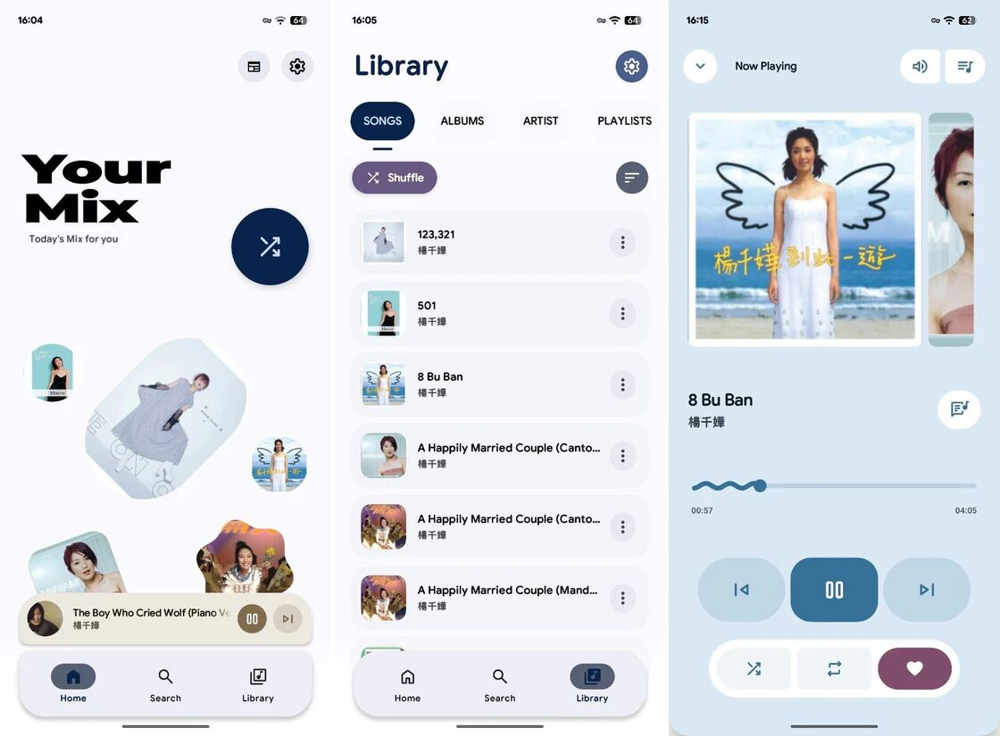
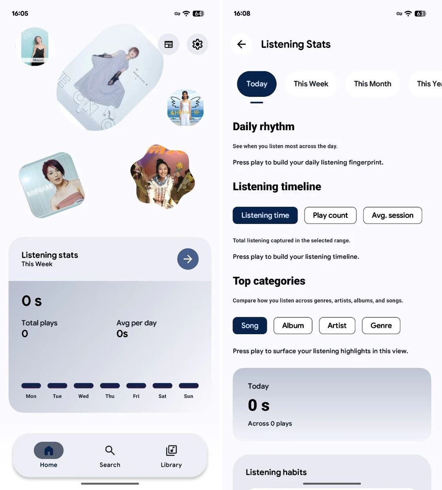

# AI4Research

<p align="center">
  
</p>

<p align="center">
  <b>智能科研助手 - 碎片化采集，AI 重构，结构化呈现</b>
</p>

<p align="center">
  
  
  
  
  
</p>

---

## 📖 项目简介

AI4Research 是一款面向科研人员的 Android 移动端应用，旨在帮助用户随时随地采集科研灵感、文献资料，并通过云端 AI 进行智能解析，最终以结构化卡片的形式呈现。

### 核心理念
> **碎片化采集** → **云端 AI 重构** → **本地结构化卡片**

---

## ✨ 主要功能

### 🔗 全场景采集
- **分享菜单采集**: 在微信、浏览器等任意 App 中，通过分享功能快速采集链接
- **全局悬浮球**: 类似 iOS 辅助触控，随时唤起采集功能
- **语音灵感**: 快速录音记录灵感，AI 自动转写整理

### 🤖 AI 智能解析
- 论文自动提取摘要、关键信息
- 比赛信息自动生成时间线
- 语音内容智能转写与结构化

### 📱 iOS 风格体验
- 高斯模糊毛玻璃效果
- 流畅弹簧动画
- 极简白灰配色
- 无阴影设计语言

---

## 🛠️ 技术栈

| 类别 | 技术 |
|------|------|
| **语言** | Kotlin 100% |
| **UI 框架** | Jetpack Compose (Material 3) |
| **架构模式** | MVVM + Clean Architecture |
| **依赖注入** | Hilt |
| **异步处理** | Coroutines + Flow |
| **网络层** | Retrofit + OkHttp |
| **本地存储** | Room (SQLite ORM) |
| **图片加载** | Coil |
| **后台任务** | WorkManager |
| **安全认证** | Biometric + EncryptedSharedPreferences |

---

## 📁 项目结构

```
app/src/main/java/com/example/ai4research/
├── core/                  # 核心基础库
│   ├── network/           # 网络拦截器、Token 管理
│   ├── security/          # 生物识别、密码加密
│   ├── theme/             # iOS 风格主题系统
│   └── util/              # 工具类、扩展函数
├── di/                    # Hilt 依赖注入模块
├── domain/                # 业务逻辑层
│   └── model/             # 领域模型
├── data/                  # 数据层
│   ├── remote/            # API 服务、DTO
│   ├── local/             # Room 数据库、DAO
│   ├── repository/        # 仓库实现
│   └── mapper/            # 数据映射
├── ui/                    # 界面层
│   ├── components/        # 通用 UI 组件
│   ├── auth/              # 登录注册
│   ├── home/              # 首页
│   ├── detail/            # 详情页
│   └── settings/          # 设置页
└── navigation/            # 导航配置
```

---

## 🚀 快速开始

### 环境要求
- Android Studio Koala (2024.1.1) 或更高版本
- JDK 11+
- Android SDK 34

### 构建步骤

1. **克隆仓库**
```bash
git clone https://github.com/AI4Research-Gist/Android-mobile-terminal.git
cd Android-mobile-terminal
```

2. **打开项目**
   - 使用 Android Studio 打开项目根目录

3. **同步 Gradle**
   - 等待 Gradle 自动同步依赖

4. **运行应用**
   - 连接 Android 设备或启动模拟器
   - 点击 Run 按钮

---

## 📸 应用截图

<p align="center">
  
  
  
</p>

<p align="center">
  
  
  
</p>

---

## 🎨 设计规范

### 色彩系统
| 名称 | 色值 | 用途 |
|------|------|------|
| Background | `#F2F2F7` | iOS 默认浅灰背景 |
| Surface | `#FFFFFF` | 纯白卡片 |
| Primary | `#007AFF` | iOS 蓝，主要操作 |
| TextPrimary | `#000000` | 主要文字 |
| TextSecondary | `#8E8E93` | 次要文字 |

### 组件规范
- **圆角**: 统一 20dp
- **阴影**: 不使用，改用 0.5dp 灰色边框
- **动画**: 弹簧动画 (dampingRatio = 0.8f)
- **触觉**: 轻触反馈 (LIGHT_IMPACT)

---

## 🔐 安全特性

- ✅ 生物识别登录 (指纹/面部)
- ✅ 密码 SHA-256 加密存储
- ✅ Token 安全存储 (EncryptedSharedPreferences)
- ✅ 网络请求 HTTPS 加密

---

## 📋 权限说明

| 权限 | 用途 |
|------|------|
| `INTERNET` | 网络请求 |
| `ACCESS_NETWORK_STATE` | 检测网络状态 |
| `USE_BIOMETRIC` | 生物识别认证 |
| `RECORD_AUDIO` | 语音录制功能 |
| `SYSTEM_ALERT_WINDOW` | 悬浮球功能 |

---

## 🗺️ 开发路线图

- [x] 基础架构搭建
- [x] 用户认证系统
- [x] iOS 风格主题
- [x] 首页信息流
- [ ] 全局悬浮球
- [ ] 语音录制功能
- [ ] 分享菜单采集
- [ ] AI 内容解析
- [ ] Markdown 渲染

---

## 🤝 贡献指南

欢迎提交 Issue 和 Pull Request！

1. Fork 本仓库
2. 创建特性分支 (`git checkout -b feature/AmazingFeature`)
3. 提交更改 (`git commit -m 'Add some AmazingFeature'`)
4. 推送到分支 (`git push origin feature/AmazingFeature`)
5. 提交 Pull Request

---

## 📄 开源协议

本项目采用 MIT 协议 - 查看 [LICENSE](LICENSE) 文件了解详情

---

## 📞 联系我们

- **GitHub**: [AI4Research-Gist](https://github.com/AI4Research-Gist)
- **Issues**: [提交问题](https://github.com/AI4Research-Gist/Android-mobile-terminal/issues)

---

<p align="center">
  Made with ❤️ by AI4Research Team
</p>
