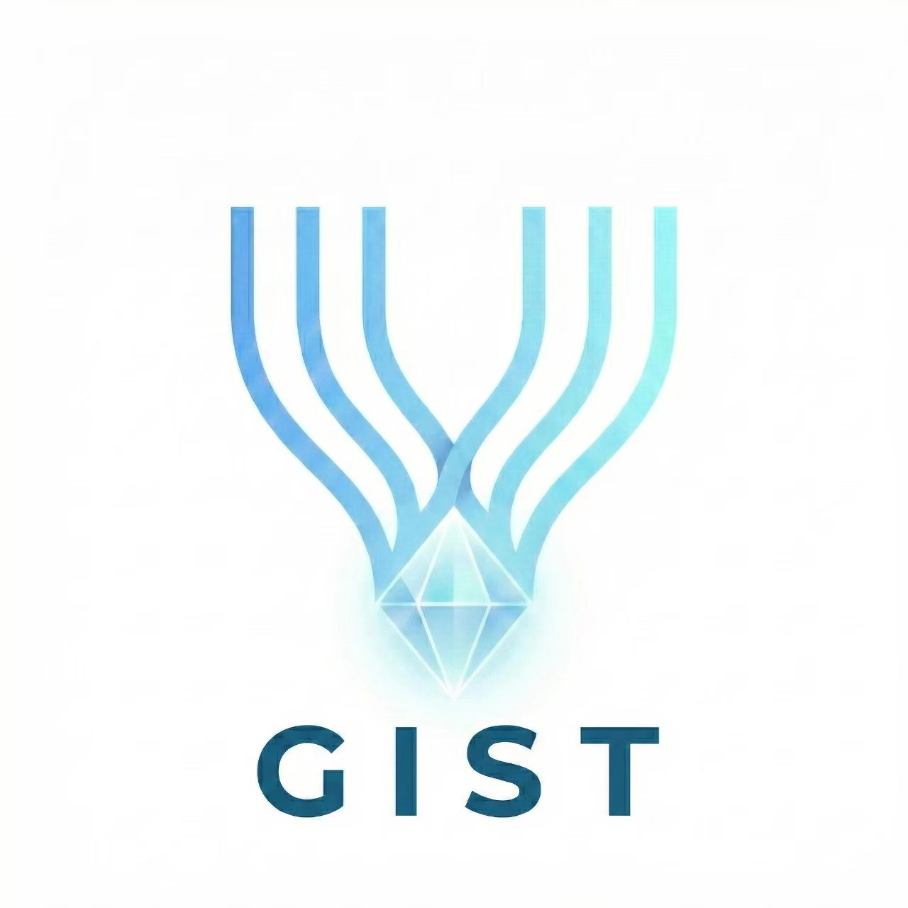

# Gist·简研

<p align="center">
  
</p>

<p align="center">
  <b>Gist·简研 · 面向科研与学习场景的移动端 AI 研究助手</b>
</p>

<p align="center">
  
  
  
  
  
</p>

---

## 项目简介

**Gist·简研** 是一个面向科研与学习场景的信息采集与分析助手，目标是把分散在手机使用过程中的研究信息统一收进系统，并沉淀为可持续管理的研究卡片。

它主要解决的是这几类内容的统一处理：

- 网页链接
- 图片与截图
- 论文与资料
- 比赛与项目背景
- 临时灵感与原始语音

应用采用 Hybrid 形态：

- **主列表与交互** 使用 WebView 内的 React/Tailwind 页面
- **详情页与系统能力** 使用原生 Compose
- **本地数据** 由 Room 承担单一事实来源
- **远端解析与同步** 由 NocoDB + SiliconFlow 支撑

---

## 核心能力

### 1. 多入口采集

- 支持链接导入、图片导入、OCR 整理、悬浮窗采集
- 支持全屏截图、区域截图、手动输入链接
- 支持快速灵感录入，可附加图片和原始语音

### 2. 统一研究卡片管理

- 统一管理 `paper / article / competition / insight / voice`
- 支持搜索、筛选、阅读状态、项目归属和解析状态展示
- 资料条目支持本地优先显示和后台解析回填

### 3. 详情页理解能力

- 详情页支持 Markdown 渲染与原生编辑
- `paper / article` 支持结构化阅读卡
- 支持围绕当前条目进行 AI 问答
- 灵感详情支持图片预览与原始语音播放

### 4. 知识连接与研究推进

- 支持 `article -> paper` 自动关联
- 支持灵感反查相关资料
- 支持双文献对比

### 5. 项目级沉淀

- 支持项目研究背景 Markdown
- 支持项目总览、重点论文、灵感汇总
- 支持 AI 项目总结与 Markdown 导出

---

## 技术栈

### Android Native

- Kotlin
- Jetpack Compose
- Hilt
- Room
- DataStore
- EncryptedSharedPreferences
- Retrofit + OkHttp

### Hybrid Web UI

- React
- Tailwind CSS
- Framer Motion
- Lucide React

### AI & Backend

- NocoDB
- SiliconFlow

---

## 架构概览

```text
Web UI (React) <-> JS Bridge <-> ViewModel <-> Repository
                                       |-> Room (SSOT)
                                       |-> NocoDB API
                                       |-> AIService (SiliconFlow)

FloatingWindowService -> AIService -> Repository -> Room/NocoDB
```

---

## 快速开始

### 环境要求

- Android Studio
- JDK 17
- Android SDK 34+

### 本地运行

1. 打开项目并等待 Gradle 同步完成。
2. 在根目录配置 `.env.local`。
3. 连接 Android 设备或启动模拟器。
4. 运行 `app` 模块。

---

## 配置项

在 `.env.local` 或系统环境变量中提供：

- `AI4RESEARCH_NOCO_BASE_URL`
- `AI4RESEARCH_NOCO_TOKEN`
- `AI4RESEARCH_SILICONFLOW_BASE_URL`
- `AI4RESEARCH_SILICONFLOW_API_KEY`

示例可参考 [`.env.local.example`](./.env.local.example)。

> 说明：Web UI 使用外部 CDN/ESM 资源，运行主界面时需要网络。

---

## 目录结构

```text
app/                       Android 主工程
gradle/                    Gradle Wrapper 与版本配置
build.gradle.kts           根构建文件
settings.gradle.kts        Gradle 模块入口
gradlew / gradlew.bat      构建脚本
.env.local.example         环境变量示例
README.md                  项目说明
```

---

## 权限说明

- `INTERNET`：访问远端接口与 AI 服务
- `RECORD_AUDIO`：语音采集
- `SYSTEM_ALERT_WINDOW`：悬浮窗助手
- `FOREGROUND_SERVICE`：悬浮窗与后台任务
- `FOREGROUND_SERVICE_MEDIA_PROJECTION`：截图采集
- `POST_NOTIFICATIONS`：通知
